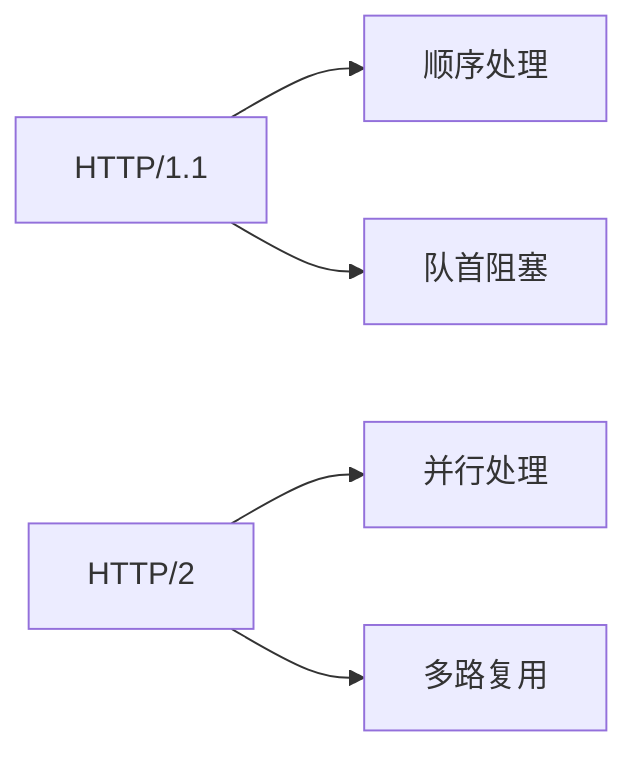
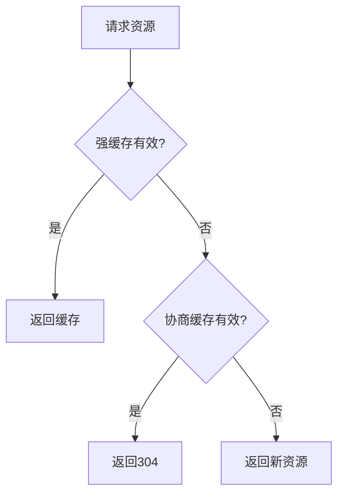
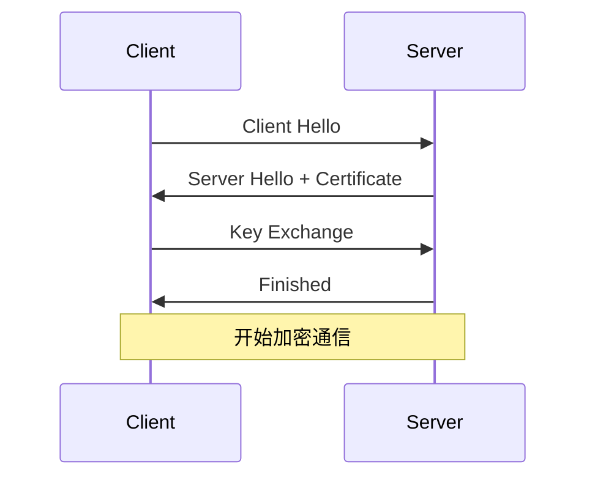

****# HTTP协议基础知识

## 1. HTTP协议基础

### 1.1 HTTP协议概述
HTTP（HyperText Transfer Protocol）是应用层协议，用于在Web浏览器和Web服务器之间传输数据。

**主要特点：**
- 无状态协议：每个请求都是独立的
- 基于请求-响应模式
- 支持多种数据格式（HTML、JSON、XML等）
- 可扩展的头部字段

### 1.2 HTTP请求方法
- **GET**: 获取资源，幂等操作
- **POST**: 提交数据，非幂等
- **PUT**: 更新资源，幂等
- **DELETE**: 删除资源，幂等
- **HEAD**: 获取响应头
- **OPTIONS**: 获取支持的方法
- **PATCH**: 部分更新资源

### 1.3 HTTP状态码
- **1xx**: 信息性状态码
- **2xx**: 成功状态码（200 OK）
- **3xx**: 重定向状态码（301、302、304）
- **4xx**: 客户端错误（400、401、403、404）
- **5xx**: 服务器错误（500、502、503）

## 2. HTTP/1.1 vs HTTP/2

### 2.1 HTTP/1.1的特点
- 基于文本的协议
- 每个连接只能处理一个请求-响应
- 存在队首阻塞问题
- 头部信息重复传输

### 2.2 HTTP/2的改进
- **二进制协议**: 更高效的解析
- **多路复用**: 单个连接处理多个请求
- **头部压缩**: HPACK算法减少头部大小
- **服务器推送**: 主动推送资源
- **流优先级**: 控制资源加载顺序

### 2.3 多路复用解决队首阻塞


## 3. HTTP连接类型

### 3.1 短连接 vs 长连接

**短连接：**
- 每次请求建立新连接
- 请求完成后立即关闭
- 优点：简单，无状态
- 缺点：频繁建立连接开销大

**长连接：**
- 复用TCP连接
- 多个请求使用同一连接
- 优点：减少连接开销
- 缺点：需要管理连接状态

### 3.2 Keep-Alive机制
```http
Connection: keep-alive
Keep-Alive: timeout=5, max=1000
```

**参数说明：**
- `timeout`: 空闲超时时间
- `max`: 最大请求数

### 3.3 连接池
```javascript
// 连接池示例
class ConnectionPool {
    constructor(maxConnections = 10) {
        this.pool = [];
        this.maxConnections = maxConnections;
    }
    
    getConnection() {
        // 获取可用连接或创建新连接
    }
    
    releaseConnection(connection) {
        // 释放连接回池中
    }
}
```

## 4. HTTP缓存机制

### 4.1 强缓存
**Cache-Control:**
```http
Cache-Control: max-age=3600
Cache-Control: no-cache
Cache-Control: no-store
Cache-Control: must-revalidate
```

**Expires:**
```http
Expires: Wed, 21 Oct 2023 07:28:00 GMT
```

### 4.2 协商缓存
**Last-Modified/If-Modified-Since:**
```http
Last-Modified: Wed, 21 Oct 2023 07:28:00 GMT
If-Modified-Since: Wed, 21 Oct 2023 07:28:00 GMT
```

**ETag/If-None-Match:**
```http
ETag: "33a64df551"
If-None-Match: "33a64df551"
```

### 4.3 缓存策略


## 5. HTTP安全

### 5.1 HTTP vs HTTPS
**HTTP特点：**
- 明文传输
- 无加密
- 容易被中间人攻击

**HTTPS特点：**
- 加密传输
- 身份验证
- 数据完整性保护

### 5.2 HTTPS加密过程


### 5.3 SSL/TLS握手步骤
1. **Client Hello**: 客户端发送支持的加密套件
2. **Server Hello**: 服务器选择加密套件并发送证书
3. **Key Exchange**: 密钥交换（RSA/ECDHE/DHE）
4. **Finished**: 验证握手完整性

## 6. HTTP代理

### 6.1 代理服务器类型
- **正向代理**: 客户端代理
- **反向代理**: 服务器代理
- **透明代理**: 无感知代理

### 6.2 代理对连接的影响
```http
# 代理可能添加的头部
Via: proxy-server
X-Forwarded-For: client-ip
X-Real-IP: client-ip
```

### 6.3 防止代理修改头部
```javascript
// 客户端验证示例
function verifyHeaders(originalHeaders, receivedHeaders) {
    // 验证关键头部是否被修改
    const criticalHeaders = ['Authorization', 'Content-Type'];
    return criticalHeaders.every(header => 
        originalHeaders[header] === receivedHeaders[header]
    );
}
```

## 7. HTTP性能优化

### 7.1 连接优化
- 使用HTTP/2多路复用
- 启用Keep-Alive
- 连接池管理
- 域名分片

### 7.2 缓存优化
- 合理设置缓存策略
- 使用CDN
- 浏览器缓存
- 应用层缓存

### 7.3 压缩优化
```http
Accept-Encoding: gzip, deflate, br
Content-Encoding: gzip
```

## 8. 常见问题与解决方案

### 8.1 队首阻塞问题
**HTTP/1.1队首阻塞：**
- 原因：单个连接顺序处理请求
- 解决：域名分片、连接池

**HTTP/2队首阻塞：**
- 原因：TCP层面的阻塞
- 解决：HTTP/3使用QUIC协议

### 8.2 连接管理
```javascript
// 连接复用示例
class HTTPClient {
    constructor() {
        this.connections = new Map();
    }
    
    async request(url, options) {
        const connection = this.getConnection(url);
        return connection.request(options);
    }
    
    getConnection(url) {
        // 获取或创建连接
    }
}
```

### 8.3 错误处理
```javascript
// HTTP错误处理
async function handleHTTPError(response) {
    if (!response.ok) {
        switch (response.status) {
            case 404:
                throw new Error('资源未找到');
            case 500:
                throw new Error('服务器内部错误');
            default:
                throw new Error(`HTTP错误: ${response.status}`);
        }
    }
    return response;
}
```

## 9. 最佳实践

### 9.1 请求优化
- 合并小请求
- 使用适当的HTTP方法
- 设置合理的超时时间
- 实现重试机制

### 9.2 响应优化
- 压缩响应内容
- 设置合适的缓存头
- 使用CDN加速
- 实现负载均衡

### 9.3 监控与调试
```javascript
// HTTP请求监控
class HTTPMonitor {
    logRequest(request) {
        console.log(`[${new Date().toISOString()}] ${request.method} ${request.url}`);
    }
    
    logResponse(response) {
        console.log(`[${new Date().toISOString()}] ${response.status} ${response.url}`);
    }
}
```

## 10. 总结

HTTP协议是Web应用的基础，理解其工作原理对于开发高性能、安全的Web应用至关重要。通过合理使用HTTP/2、缓存机制、连接管理等技术，可以显著提升应用性能。同时，注意安全性和错误处理，确保应用的稳定性和可靠性。 