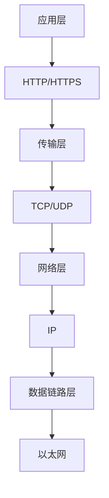
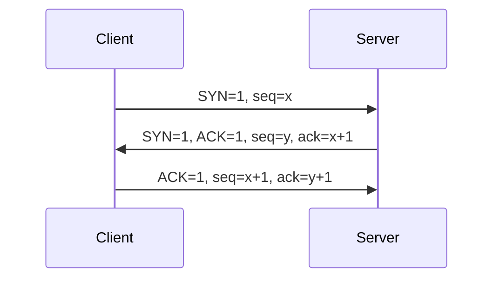
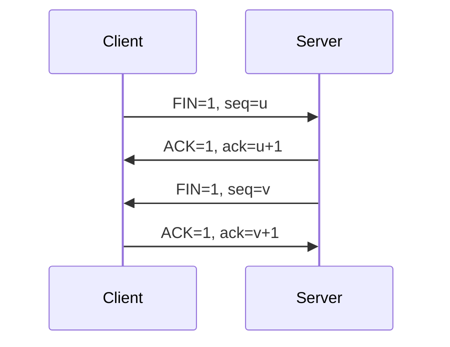
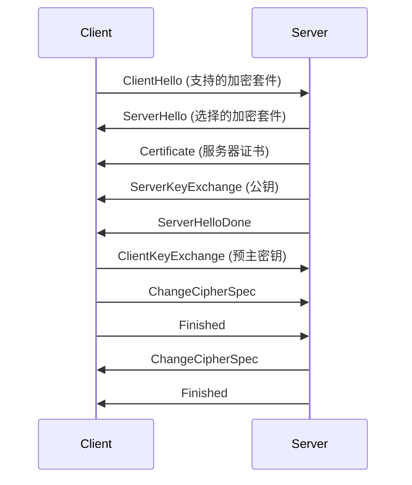
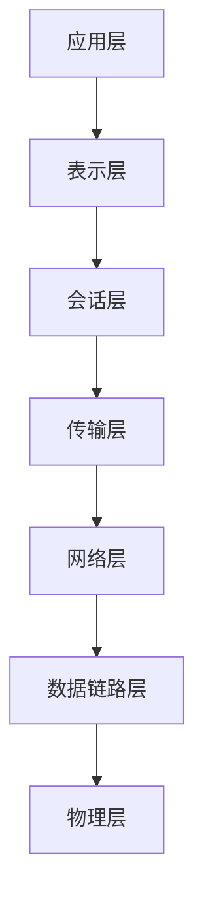

# 技术问答记录 - 第三部分：HTTP协议与网络

## HTTP协议基础

### HTTP协议层次



### HTTP/1 vs HTTP/2

**HTTP/1.1特点：**
- 文本协议
- 请求-响应模式
- 队首阻塞问题
- 连接复用有限

**HTTP/2特点：**
- 二进制协议
- 多路复用
- 服务器推送
- 头部压缩

```javascript
// HTTP/2多路复用示例
const http2 = require('http2');

const client = http2.connect('https://example.com');

// 多个请求可以并发发送
const req1 = client.request({ ':path': '/api/users' });
const req2 = client.request({ ':path': '/api/posts' });

req1.on('response', (headers) => {
  console.log('Response 1:', headers);
});

req2.on('response', (headers) => {
  console.log('Response 2:', headers);
});
```

### TCP vs UDP

**TCP特点：**
- 面向连接
- 可靠传输
- 有序传输
- 流量控制

**UDP特点：**
- 无连接
- 不可靠传输
- 无序传输
- 无流量控制

```javascript
// TCP连接示例
const net = require('net');

const client = new net.Socket();

client.connect(3000, 'localhost', () => {
  console.log('Connected to server');
  client.write('Hello server!');
});

client.on('data', (data) => {
  console.log('Received:', data.toString());
});
```

### TCP三次握手



```javascript
// TCP三次握手状态
const tcpStates = {
  CLOSED: 'CLOSED',
  LISTEN: 'LISTEN',
  SYN_SENT: 'SYN_SENT',
  SYN_RECEIVED: 'SYN_RECEIVED',
  ESTABLISHED: 'ESTABLISHED'
};

function tcpHandshake() {
  // 1. 客户端发送SYN
  client.send({ SYN: 1, seq: x });
  client.state = 'SYN_SENT';
  
  // 2. 服务器响应SYN+ACK
  server.receive({ SYN: 1, ACK: 1, seq: y, ack: x + 1 });
  server.state = 'SYN_RECEIVED';
  
  // 3. 客户端发送ACK
  client.send({ ACK: 1, seq: x + 1, ack: y + 1 });
  client.state = 'ESTABLISHED';
  server.state = 'ESTABLISHED';
}
```

### TCP四次挥手



```javascript
// TCP四次挥手
function tcpClose() {
  // 1. 客户端发送FIN
  client.send({ FIN: 1, seq: u });
  client.state = 'FIN_WAIT_1';
  
  // 2. 服务器响应ACK
  server.send({ ACK: 1, ack: u + 1 });
  server.state = 'CLOSE_WAIT';
  client.state = 'FIN_WAIT_2';
  
  // 3. 服务器发送FIN
  server.send({ FIN: 1, seq: v });
  server.state = 'LAST_ACK';
  
  // 4. 客户端发送ACK
  client.send({ ACK: 1, ack: v + 1 });
  client.state = 'TIME_WAIT';
  server.state = 'CLOSED';
}
```

### 2MSL等待时间

```javascript
// 2MSL等待时间计算
const MSL = 2 * 60 * 1000; // 2分钟
const TIME_WAIT = 2 * MSL; // 4分钟

function timeWait() {
  // TIME_WAIT状态持续2MSL
  setTimeout(() => {
    // 确保最后一个ACK到达
    // 防止旧连接的数据包干扰新连接
    connection.state = 'CLOSED';
  }, TIME_WAIT);
}
```

### HTTPS加密过程



```javascript
// TLS握手过程
async function tlsHandshake() {
  // 1. 客户端发送支持的加密套件
  const clientHello = {
    cipherSuites: ['TLS_AES_256_GCM_SHA384', 'TLS_CHACHA20_POLY1305_SHA256'],
    random: generateRandom(32)
  };
  
  // 2. 服务器选择加密套件
  const serverHello = {
    cipherSuite: 'TLS_AES_256_GCM_SHA384',
    random: generateRandom(32)
  };
  
  // 3. 证书验证
  const certificate = await verifyCertificate(serverCert);
  
  // 4. 密钥交换
  const preMasterSecret = generatePreMasterSecret();
  const masterSecret = deriveMasterSecret(preMasterSecret, clientRandom, serverRandom);
  
  // 5. 生成会话密钥
  const sessionKeys = deriveSessionKeys(masterSecret);
}
```

### 密钥交换时机

密钥交换在TLS握手的ClientKeyExchange阶段进行：

```javascript
// 密钥交换过程
function keyExchange() {
  // 1. 客户端生成预主密钥
  const preMasterSecret = crypto.randomBytes(48);
  
  // 2. 使用服务器公钥加密
  const encryptedPreMaster = crypto.publicEncrypt(
    serverPublicKey,
    preMasterSecret
  );
  
  // 3. 发送给服务器
  client.send({
    type: 'ClientKeyExchange',
    data: encryptedPreMaster
  });
  
  // 4. 服务器使用私钥解密
  const decryptedPreMaster = crypto.privateDecrypt(
    serverPrivateKey,
    encryptedPreMaster
  );
  
  // 5. 双方生成主密钥
  const masterSecret = deriveMasterSecret(
    preMasterSecret,
    clientRandom,
    serverRandom
  );
}
```

## HTTP长连接

### 保持连接机制

```javascript
// HTTP长连接实现
class HTTPKeepAlive {
  constructor() {
    this.connections = new Map();
    this.timeout = 60000; // 60秒
  }
  
  // 创建连接
  createConnection(host, port) {
    const key = `${host}:${port}`;
    
    if (this.connections.has(key)) {
      const conn = this.connections.get(key);
      if (conn.isAlive()) {
        return conn;
      }
    }
    
    const connection = new Connection(host, port);
    this.connections.set(key, connection);
    
    // 设置保活定时器
    this.setupKeepAlive(connection);
    
    return connection;
  }
  
  // 设置保活
  setupKeepAlive(connection) {
    const timer = setInterval(() => {
      if (connection.isIdle()) {
        connection.sendKeepAlive();
      } else {
        clearInterval(timer);
        this.connections.delete(connection.key);
      }
    }, this.timeout);
  }
}
```

### TCP Keep-Alive

```javascript
// TCP Keep-Alive配置
const socket = new net.Socket();

socket.setKeepAlive(true, {
  initialDelay: 1000, // 1秒后开始探测
  interval: 3000,     // 每3秒探测一次
  probes: 5           // 最多探测5次
});

socket.on('error', (err) => {
  if (err.code === 'ECONNRESET') {
    console.log('Connection reset by peer');
  }
});
```

### 应用层心跳

```javascript
// 应用层心跳实现
class Heartbeat {
  constructor(connection) {
    this.connection = connection;
    this.interval = 30000; // 30秒
    this.timer = null;
  }
  
  start() {
    this.timer = setInterval(() => {
      this.sendHeartbeat();
    }, this.interval);
  }
  
  sendHeartbeat() {
    const heartbeat = {
      type: 'heartbeat',
      timestamp: Date.now()
    };
    
    this.connection.send(JSON.stringify(heartbeat));
  }
  
  stop() {
    if (this.timer) {
      clearInterval(this.timer);
      this.timer = null;
    }
  }
}
```

### 中间件挑战

```javascript
// 处理中间件问题
class ProxyAwareConnection {
  constructor() {
    this.headers = {
      'Connection': 'keep-alive',
      'Keep-Alive': 'timeout=60, max=1000',
      'Proxy-Connection': 'keep-alive' // 针对代理服务器
    };
  }
  
  // 检测代理
  detectProxy() {
    const proxyHeaders = [
      'Via',
      'X-Forwarded-For',
      'X-Real-IP',
      'Proxy-Connection'
    ];
    
    return proxyHeaders.some(header => 
      this.request.headers[header]
    );
  }
  
  // 根据代理调整策略
  adjustStrategy() {
    if (this.detectProxy()) {
      // 代理环境下使用更短的超时时间
      this.timeout = 30000;
      this.maxRetries = 3;
    } else {
      this.timeout = 60000;
      this.maxRetries = 5;
    }
  }
}
```

## HTTP vs HTTPS

### 主要区别

| 特性 | HTTP | HTTPS |
|------|------|-------|
| 端口 | 80 | 443 |
| 加密 | 无 | TLS/SSL |
| 证书 | 不需要 | 需要 |
| 性能 | 快 | 稍慢（握手开销） |
| 安全性 | 明文传输 | 加密传输 |

### HTTPS优势

```javascript
// HTTPS安全特性
const httpsFeatures = {
  // 1. 数据加密
  encryption: 'AES-256-GCM',
  
  // 2. 身份认证
  authentication: 'X.509证书',
  
  // 3. 数据完整性
  integrity: 'HMAC-SHA256',
  
  // 4. 防重放攻击
  antiReplay: '序列号机制'
};

// HTTPS配置示例
const https = require('https');
const fs = require('fs');

const options = {
  key: fs.readFileSync('private-key.pem'),
  cert: fs.readFileSync('certificate.pem'),
  ca: fs.readFileSync('ca-certificate.pem')
};

const server = https.createServer(options, (req, res) => {
  res.writeHead(200);
  res.end('Hello HTTPS!');
});

server.listen(443);
```

## OSI七层模型

### 层次结构



### 各层协议

```javascript
// OSI七层协议
const osiLayers = {
  // 7. 应用层
  application: {
    protocols: ['HTTP', 'HTTPS', 'FTP', 'SMTP', 'DNS'],
    responsibility: '为用户应用程序提供网络服务'
  },
  
  // 6. 表示层
  presentation: {
    protocols: ['SSL', 'TLS', 'JPEG', 'MPEG'],
    responsibility: '数据格式转换、加密解密'
  },
  
  // 5. 会话层
  session: {
    protocols: ['NetBIOS', 'RPC'],
    responsibility: '建立、管理、终止会话'
  },
  
  // 4. 传输层
  transport: {
    protocols: ['TCP', 'UDP'],
    responsibility: '端到端通信、流量控制'
  },
  
  // 3. 网络层
  network: {
    protocols: ['IP', 'ICMP', 'ARP'],
    responsibility: '路由选择、地址分配'
  },
  
  // 2. 数据链路层
  dataLink: {
    protocols: ['Ethernet', 'WiFi', 'PPP'],
    responsibility: '帧传输、错误检测'
  },
  
  // 1. 物理层
  physical: {
    protocols: ['Ethernet', 'WiFi', 'Bluetooth'],
    responsibility: '比特传输、物理连接'
  }
};
```

### TCP/IP四层模型

```javascript
// TCP/IP四层模型
const tcpipLayers = {
  // 4. 应用层
  application: {
    protocols: ['HTTP', 'HTTPS', 'FTP', 'SMTP', 'DNS', 'SSH'],
    examples: ['浏览器', '邮件客户端', '文件传输工具']
  },
  
  // 3. 传输层
  transport: {
    protocols: ['TCP', 'UDP'],
    functions: ['可靠传输', '流量控制', '拥塞控制']
  },
  
  // 2. 网络层
  internet: {
    protocols: ['IP', 'ICMP', 'ARP', 'RARP'],
    functions: ['路由', '地址分配', '网络诊断']
  },
  
  // 1. 网络接口层
  networkInterface: {
    protocols: ['Ethernet', 'WiFi', 'PPP', 'ATM'],
    functions: ['物理连接', '数据帧传输']
  }
};
```

## 总结

本次问答涵盖了前端开发、网络协议、浏览器机制等多个技术领域的核心概念。从React的声明式编程到HTTP协议的底层实现，从浏览器渲染机制到热更新技术，这些知识点构成了现代Web开发的重要基础。

关键要点：
1. **React生态**：理解声明式编程、组件生命周期、Hooks机制
2. **JavaScript基础**：掌握原型继承、类继承、性能优化
3. **网络协议**：深入理解HTTP/HTTPS、TCP/UDP、连接管理
4. **浏览器机制**：了解渲染流程、缓存策略、分层栅格化
5. **开发工具**：掌握热更新、模块化、构建优化

这些知识点的掌握对于成为一名优秀的前端工程师至关重要。 